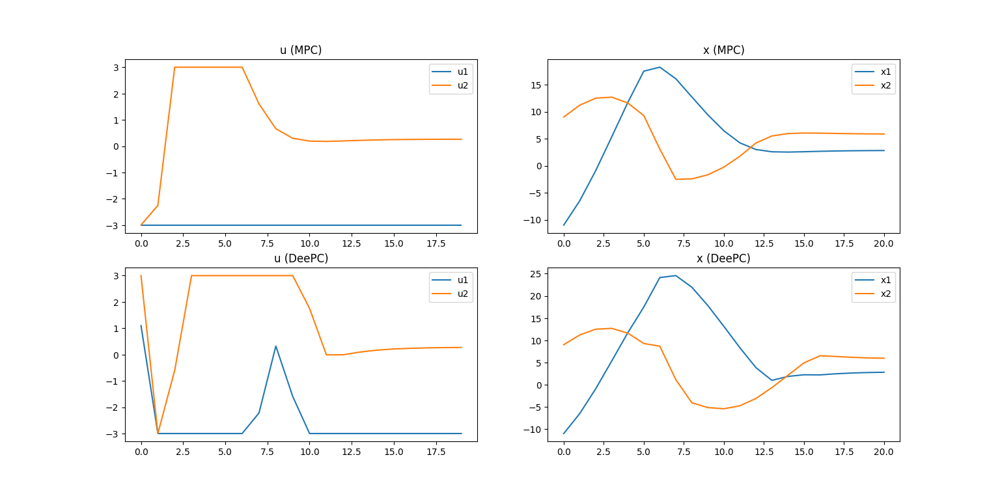

# Control Methods

Collection of modern control strategies implemented in Python, mainly using numpy and cvxpy.

## State Space Model

For a given linear state space model (that includes an input delay), two controllers were implemented:

- **Model Predictive Control**: Nominal MPC controller with input constraints.
- **Data-enabled Predictive Control**: DeePC controller that constructs its input and output Hankel matrices once instantiated.

 

## Markov Decision Process

For a Markov Decision Process, such as Tic Tac Toe or a grid with a starting cell and goal cell, a few controllers were tested:

#### Model-dependent

**Policy Iteration** and **Value Iteration** were used to generate a policy for the processes given their models' transition probabilities.

#### Reinforcement Learning

Some variations of reinforcement learning were used to obtain efficient policies for the processes without any knowledge about their models, namely:

- Monte Carlo Learning
- State–action–reward–state–action (SARSA)
- Q-Learning