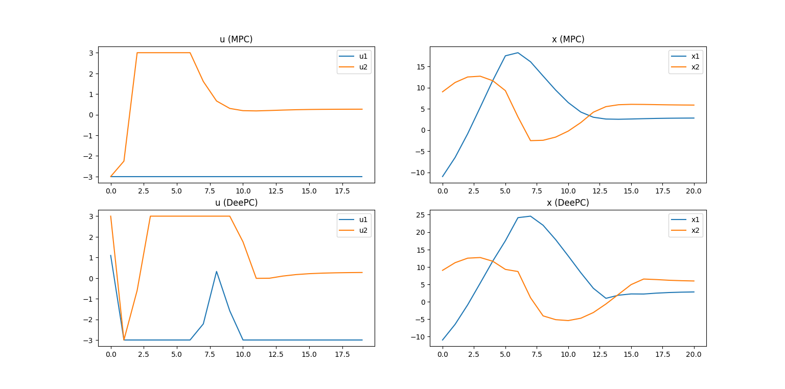

# Control Methods

Collection of modern control strategies implemented in:
- C++, using Eigen and [osqp-eigen](https://github.com/robotology/osqp-eigen)
- Python, using numpy and cvxpy

## State Space Model

For a given LTI state space model, two controllers were implemented:

- **Model Predictive Control**: Nominal MPC controller with input constraints.
- **Data-enabled Predictive Control**: DeePC controller that constructs its input and output Hankel matrices once instantiated.

 

## Markov Decision Process

For a Markov Decision Process, such as Tic Tac Toe or a grid with a starting cell and goal cell, a few controllers were tested:

#### Model-dependent

Policy Iteration and Value Iteration were used to generate a policy for the processes given their models' transition probabilities.

#### Reinforcement Learning

Some variations of reinforcement learning were used to obtain efficient model-independent policies for the processes, namely:

- Q-Learning
- State–action–reward–state–action (SARSA)
- Monte Carlo Learning